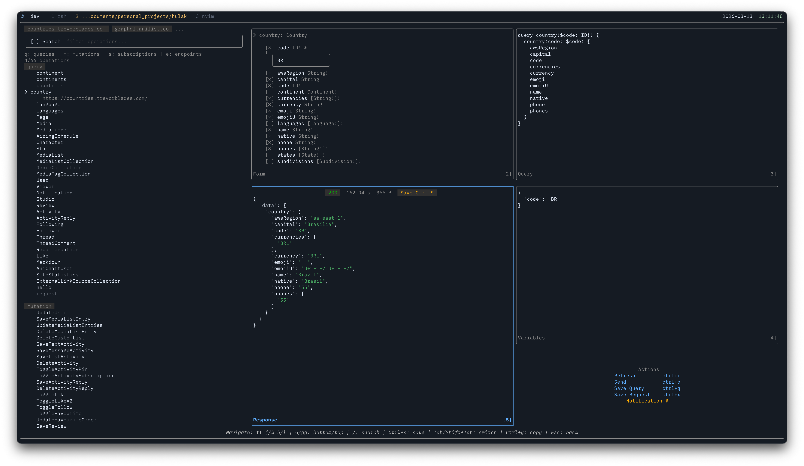
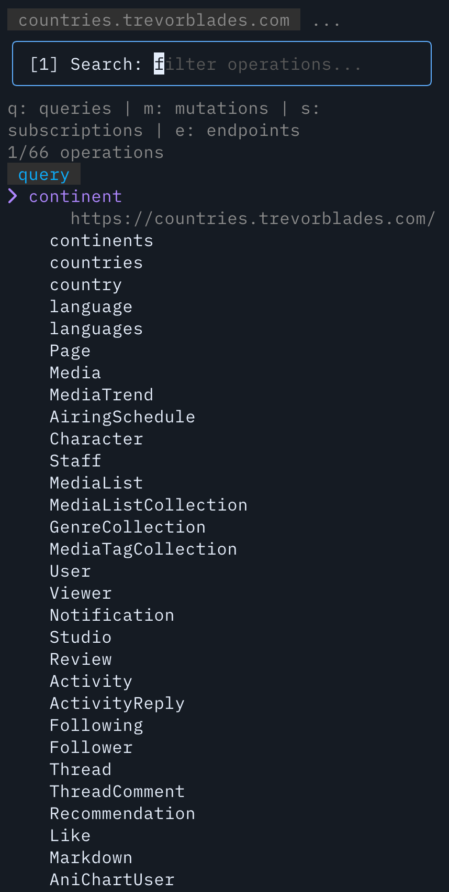
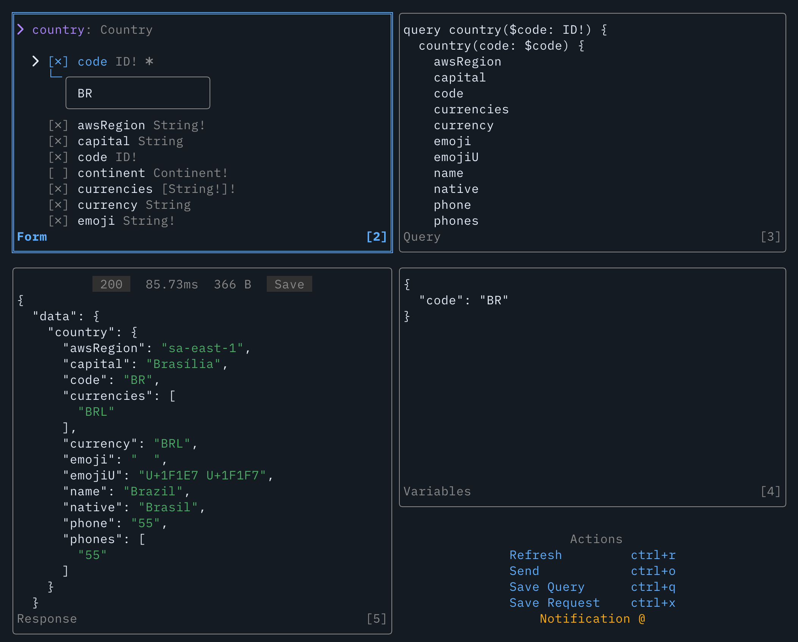

# GraphQL Explorer



## Why?

I built this TUI because I work with a lot of GraphQL endpoints and often know a query exists but not where, and when you are dealing with hundreds of operations the hard part is not sending the request but finding the right one, understanding its inputs and outputs, and seeing what still works, especially when tools like Postman only let you explore one endpoint at a time. The explorer is built to solve that workflow inside the terminal.

## Getting Started


<p align="center"><em>Full GraphQL flow Demo</em></p>

> [!Note]
> Think of it like this: edit the GraphQL request in YAML, then use the TUI to view, explore, and run it.

The GraphQL explorer opens a full-screen TUI for browsing schemas, finding operations, building queries and variables, executing requests, and saving the generated query, response, or a new Hulak request file.

Start it with `hulak gql <file/dir-path>`, where `<path>` is either a GraphQL file or a directory of request yaml files.

Use one of these entry points:

```bash
# Explore one explicit file
hulak gql e2etests/gql_schemas/countries.yml

# Explore the current directory
hulak gql .

# Explore a directory with a pre-selected environment
hulak gql -env staging ./collections/graphql
```

The explorer loads the selected file set, resolves endpoints, fetches schemas, and collects queries, mutations, subscriptions, input types, enums, object types, unions, and interfaces for interactive exploration.

If you run `hulak gql`, Hulak prepares GraphQL files first and then shows the environment selector only if GraphQL files need environment values and you did not already pass `-env`.

## The Explorer Layout

The explorer is a full-screen terminal UI.

### Left Side

<p align="center">
  
</p>

<p align="center"><em>Left panel: search and operation discovery</em></p>
The left panel is the fast navigation side.

It shows:

- operation search
- operation type filters
- endpoint filters
- the matching operations list

Search prefixes:

- `q:` only queries
- `m:` only mutations
- `s:` only subscriptions
- `e:` switch the left panel into endpoint filter mode

When endpoint filter mode is active, the left panel shows toggleable endpoints instead of operations.

You can also type `e:!term` and press Enter to keep only matching endpoints.

### Right Side


<p align="center"><em>Right panel: form, query, variables, and response</em></p>

The right side is where you inspect and build the request.

Panels:

- `Form`
  Shows operation arguments and return fields. You can toggle fields and edit argument values here.
- `Query`
  Shows the generated GraphQL query string.
- `Variables`
  Shows the generated GraphQL variables payload.
- `Response`
  Shows the executed response with status, duration, search, and save support.

There is also an actions row for the main workflow.

## File Mode And Directory Mode

The explorer supports two load modes.

### Single File Mode

Single file mode starts when the path points to one YAML file.

- The file must exist.
- The file must have a non-empty `url`.
- `kind: GraphQL` is recommended, but it is not required in single-file mode.
- Hulak applies GraphQL defaults for this mode:
  - `method` defaults to `POST`
  - `Content-Type` defaults to `application/json`

This mode is useful when you already know which file you want.

### Directory Mode

Directory mode starts when the path points to a directory.

Hulak scans the directory recursively and looks for GraphQL source files.

A file is included only when all of these are true:

- it is a YAML file Hulak can decode
- it has `kind: GraphQL` or `kind: graphql`
- it has a non-empty `url`

Directory mode ignores generated response files and `apiOptions.hk.yaml`.

This mode is the main discovery workflow. It is the fast way to answer:

- Which endpoint has this query?
- Which files point to the same schema?
- What are the input fields for this mutation?
- Which return fields are available?

## When The Environment Selector Is Shown

The explorer resolves environments only when it has to.

The environment selector is shown when:

- a GraphQL file contains template values like `{{.graphqlUrl}}`
- the URL itself needs template resolution
- or any other GraphQL request fields need environment values
- and you did not pass `hulak gql -env <name> ...`

If no environment values are needed, no selector is shown.

If you pass `-env`, Hulak skips the selector and loads that environment directly.

This matches the general single-file helper philosophy. Ask for environment only when the selected work needs it.

For environment file details, see [environment.md](./environment.md).

## How Endpoints Are Parsed And De-duplicated

The explorer does not treat every file as a separate schema load forever.

The flow is:

1. Hulak reads candidate GraphQL files.
2. Hulak resolves templates if needed.
3. Hulak prepares a normal `APIInfo` for each GraphQL file.
4. Hulak merges URL params into the final URL.
5. Hulak fetches GraphQL introspection schemas from the resolved URLs.
6. Hulak loads one schema per unique resolved endpoint URL.

This means the explorer groups operations by endpoint, not only by file name.

Hulak also keeps track of the source file path for each endpoint. That matters later because saved `.gql`, `.hk.yaml`, and response files are written beside the source GraphQL schema file when possible.

## What Hulak Reads From A GraphQL Source File

A minimal explorer source file can be this small:

```yaml
---
kind: GraphQL
url: https://countries.trevorblades.com/
headers:
  Content-Type: application/json
```

You can also keep the URL in env files:

```yaml
---
kind: GraphQL
url: "{{.graphqlUrl}}"
headers:
  Content-Type: application/json
  Authorization: Bearer {{.accessToken}}
```

The explorer uses the URL, headers, and params from these files to fetch schemas and later execute the built query.

## Main Workflow Inside The TUI

The usual workflow looks like this:

1. Open the explorer with one file or a directory.
2. Search for an operation name.
3. Narrow by endpoint if needed.
4. Open the form panel.
5. Fill or toggle argument values.
6. Toggle the return fields you want.
7. Review the generated query.
8. Review the generated variables.
9. Execute the query.
10. Save the query, save the response, or create a Hulak request file.

## Query And Variable Generation

The explorer builds the GraphQL request from the live schema metadata.

- Enabled arguments become variable declarations.
- Enabled arguments are passed into the operation call.
- Toggled return fields become the selection set.
- Nested object fields become nested selections.
- Input objects and lists are expanded into editable form items.
- Enum values are shown as dropdown choices.
- Variables are rendered using GraphQL-aware typing rules.

Simple scalar values stay simple.

- `String` and `ID` are quoted
- `Int` and `Float` stay numeric when possible
- `Boolean` stays boolean
- `null` is preserved
- list and object values are rendered as JSON-like GraphQL variables

## Executing Queries

Press `Ctrl+O` to execute the built query.

The explorer:

- clones the stored API config for the endpoint
- encodes the built query and variables into a GraphQL request body
- sends the request
- renders the response in the response panel

The response panel shows:

- status code
- duration
- pretty JSON output
- search inside the response
- save support

Current limitation:

- subscription execution is not supported yet

## Saving Files

The explorer supports several save flows.

### Save Query

`Ctrl+Q` saves a `<OperationName>.gql` file in the source directory for that endpoint.

The saved file contains:

- the generated query
- a commented `Variables:` section when variables exist

### Save Request

`Ctrl+X` creates two files:

- a `.gql` file with the generated query
- a `.hk.yaml` Hulak request file that uses `getFile`

The generated request file:

- uses `method: POST`
- sets `kind: GraphQL`
- keeps the original raw `url` when possible
- keeps original headers when possible
- writes generated variables into `body.graphql.variables`

This is the bridge between exploration and reusable checked-in request files.

### Save Response

When the response panel is focused, `Ctrl+S` saves the current response as a timestamped JSON file beside the source GraphQL file.

## Notifications And Refresh

The explorer keeps non-fatal schema issues visible without killing the whole session.

- Schema preparation warnings are shown as notifications.
- Schema fetch warnings are shown as notifications.
- `Ctrl+R` refreshes schemas and reloads the explorer data.
- `@` reopens the latest notification.

This matters when one endpoint fails but the rest still work. You still get a usable explorer session.

## Mouse And Keyboard Support

The explorer supports both keyboard-first and mouse-friendly workflows.

Useful keys:

- `Tab` and `Shift+Tab` switch panels
- `Enter` opens details or confirms actions
- `Esc` steps back one panel at a time
- `Ctrl+Y` copies the current panel content
- `/` starts search in the detail or response panel
- `gg` and `G` jump to top or bottom in supported panels
- `Ctrl+R` refreshes schemas
- `Ctrl+O` executes the query
- `Ctrl+Q` saves the query
- `Ctrl+X` creates a Hulak request file
- `Ctrl+S` saves the response when the response panel is focused

Mouse support covers:

- selecting operations
- toggling endpoints
- interacting with form fields
- clicking action buttons
- clicking the response save control

## Recommended File Patterns

Use `kind: GraphQL` on GraphQL source files that are meant for directory discovery.

For explorer source files, a small schema source file is usually enough:

```yaml
---
kind: GraphQL
url: "{{.graphqlUrl}}"
headers:
  Content-Type: application/json
```

For reusable request files generated or hand-written for execution, use the normal GraphQL request shape:

```yaml
---
method: POST
kind: GraphQL
url: "{{.graphqlUrl}}"
headers:
  Content-Type: application/json
body:
  graphql:
    query: '{{getFile "queries/GetCountries.gql"}}'
    variables:
      code: "NP"
```

## Example Session

Start from a schema source file:

```yaml
---
kind: GraphQL
url: https://countries.trevorblades.com/
headers:
  Content-Type: application/json
```

Run:

```bash
hulak gql e2etests/gql_schemas/countries.yml
```

Inside the explorer:

1. Search for `country`
2. Open the `country` query
3. Fill the `code` argument
4. Toggle fields like `name`, `native`, and `capital`
5. Press `Ctrl+O` to execute
6. Press `Ctrl+Q` to save the query or `Ctrl+X` to create a reusable request file

## Relationship To Normal Hulak Requests

The explorer does not replace normal request files.

It helps you discover, validate, and generate them faster.

The common cycle is:

1. keep lightweight GraphQL source files that describe endpoints
2. use `hulak gql` to discover and validate operations
3. save generated `.gql` and `.hk.yaml` files
4. run those saved request files later with normal Hulak commands

## Related Docs

- [body.md](./body.md)
- [actions.md](./actions.md)
- [environment.md](./environment.md)
- [response.md](./response.md)
